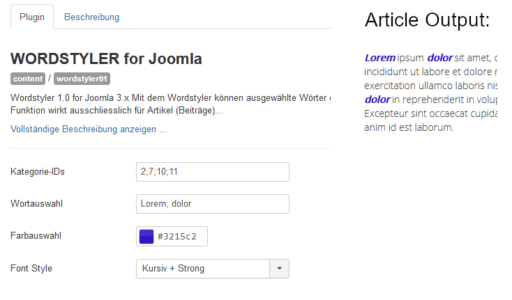

# plg_wordstyler_free
Joomla Plugin WORDSTYLER getestet unter Joomla 3.x

# Funktion

Mit dem Pugin Wordstyler können ausgewählte Worte in Artikeln bestimmter Kategorien temporär durch verschieden Styles hervorgehoben werden (solange das Plugin aktiv ist) 

# Installation
Das Plugin (ZIP-Datei plg_wordstyler_free.zip)  kann in Joomla über den Menüpunkt "Erweiterungen" installiert werden: 
Erweiterungen -> Verwalten -> Installieren -> Joomla!-Erweiterung hochladen und installieren 

Die Deinstallation kann über den Menüpunkt "Erweiterungen" vorgenommen werden:
Erweiterungen -> Verwalten -> Verwalten -> Plugin auswählen -> Deinstallieren

Eine automatische Aktualisierung ist in weiteren Versionen vorgesehen

Todo's:

- Multiple Wörter- und Styleauswahl, es können mehrere Wörter mit verschiedene Styles angezeigt werden
- Automatische Updatefunktion 
